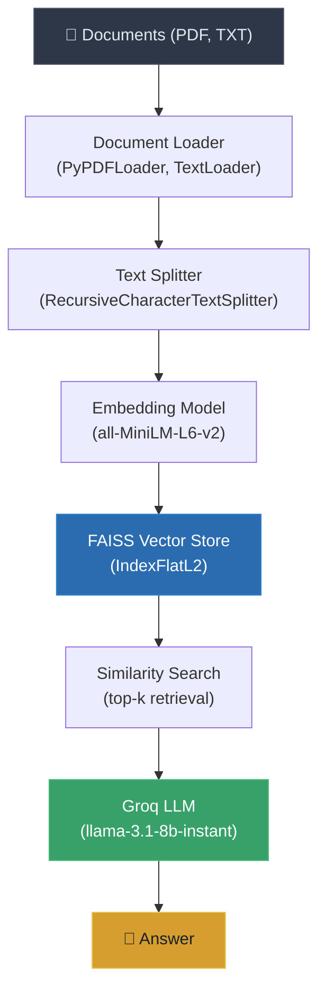

# 📄 RAG PDF Question Answering

A modular **Retrieval-Augmented Generation** pipeline for querying PDF and text documents using semantic search. Documents are chunked, embedded with SentenceTransformers, indexed in FAISS, and answered via Groq's LLM.

---

## Features

- **Multi-format document loading** — Ingests PDFs and text files from a data directory using LangChain loaders
- **Recursive text splitting** — Chunks documents with configurable size and overlap for optimal retrieval
- **Sentence embeddings** — Generates 384-dimensional vectors using `all-MiniLM-L6-v2`
- **FAISS vector store** — Persistent L2 similarity search with serialized index and metadata
- **LLM-powered answers** — Summarizes retrieved context using Groq (`llama-3.1-8b-instant`)
- **Automatic index management** — Builds the vector store on first run, reuses persisted index on subsequent runs

---

## Architecture



---

## Project Structure

```text
RAG/
├── app.py                    # Application entry point
├── main.py                   # Placeholder script
├── src/
│   ├── __init__.py
│   ├── data_loader.py        # Document loading (PDF, TXT)
│   ├── embedding.py          # Text chunking and embedding generation
│   ├── vectorstore.py        # FAISS index management (build, save, load, query)
│   └── search.py             # RAG orchestration (retrieve + LLM summarization)
├── data/
│   ├── pdf/                  # Place PDF files here
│   └── text_files/           # Place text files here
├── faiss_store/              # Persisted FAISS index and metadata (git-ignored)
├── notebook/
│   ├── document.ipynb        # Document loading experiments
│   └── pdf_loader.ipynb      # Full RAG pipeline exploration
├── pyproject.toml            # Project configuration (uv)
├── requirements.txt          # Pip dependencies
└── .env                      # API keys (git-ignored)
```

### Module Responsibilities

| Module | Responsibility |
|---|---|
| `data_loader.py` | Recursively discovers and loads `.pdf` and `.txt` files from a directory using LangChain's `PyPDFLoader` and `TextLoader` |
| `embedding.py` | Splits LangChain documents into chunks using `RecursiveCharacterTextSplitter`, then encodes them into NumPy arrays with `SentenceTransformer` |
| `vectorstore.py` | Manages a FAISS `IndexFlatL2` index — builds from documents, adds embeddings, persists to disk, loads from disk, and performs similarity search |
| `search.py` | Orchestrates the RAG pipeline: initializes the vector store and LLM, retrieves relevant chunks for a query, and generates a summarized answer via Groq |

---

## Installation

### Using uv (recommended)

```bash
git clone https://github.com/abhip161/rag-pdf-qa.git
cd rag-pdf-qa

# Create virtual environment and install dependencies
uv sync
```

### Using pip

```bash
git clone https://github.com/abhip161/rag-pdf-qa.git
cd rag-pdf-qa

python -m venv .venv

# Windows
.venv\Scripts\activate
# macOS / Linux
source .venv/bin/activate

pip install -r requirements.txt
```

---

## Configuration

Create a `.env` file in the project root:

```env
GROQ_API_KEY=your_groq_api_key_here
```

| Variable | Description | Required |
|---|---|---|
| `GROQ_API_KEY` | API key from [Groq Console](https://console.groq.com/) | Yes |

---

## Usage

### 1. Add documents

Place your PDF files in `data/pdf/` and text files in `data/text_files/`.

### 2. Run the pipeline

```bash
python app.py
```

On the first run, the pipeline will:
1. Load all documents from `data/`
2. Chunk and embed them
3. Build and persist the FAISS index to `faiss_store/`

On subsequent runs, it loads the persisted index directly.

### 3. Programmatic usage

```python
from src.search import RAGSearch

rag = RAGSearch()
answer = rag.search_and_summarize("What is positional encoding?", top_k=3)
print(answer)
```

#### Constructor parameters

```python
RAGSearch(
    persist_dir="faiss_store",           # Directory for FAISS index persistence
    embedding_model="all-MiniLM-L6-v2",  # SentenceTransformer model name
    llm_model="llama-3.1-8b-instant"     # Groq LLM model
)
```

---

## How It Works

1. **Document Loading** — `data_loader.py` recursively scans the data directory for `.pdf` and `.txt` files. Each file is loaded into LangChain `Document` objects containing page content and metadata.

2. **Chunking** — `embedding.py` splits documents into 1000-character chunks with 200-character overlap using `RecursiveCharacterTextSplitter`. The splitter uses a hierarchy of separators (`\n\n`, `\n`, ` `, `""`) to preserve semantic boundaries.

3. **Embedding** — Each chunk is encoded into a 384-dimensional vector using the `all-MiniLM-L6-v2` model from SentenceTransformers.

4. **Indexing** — `vectorstore.py` creates a FAISS `IndexFlatL2` index from the embedding vectors. The index and chunk metadata are serialized to disk (`faiss.index` + `metadata.pkl`).

5. **Retrieval** — When a query arrives, it is embedded with the same model and searched against the FAISS index using L2 distance. The top-k most similar chunks are returned with their metadata.

6. **Generation** — The retrieved chunk texts are concatenated into a context string and sent to Groq's `llama-3.1-8b-instant` LLM with a summarization prompt. The LLM returns a natural-language answer grounded in the retrieved context.

---

## Technologies

| Category | Technology | Purpose |
|---|---|---|
| Language | Python 3.14+ | Core runtime |
| Framework | LangChain | Document loading, text splitting |
| Embeddings | SentenceTransformers (`all-MiniLM-L6-v2`) | 384-dim sentence embeddings |
| Vector Store | FAISS (`faiss-cpu`) | L2 similarity search |
| LLM | Groq (`llama-3.1-8b-instant`) | Answer generation |
| LLM Client | `langchain-groq` | Groq API integration |
| PDF Parsing | PyPDF, PyMuPDF | PDF text extraction |
| Config | python-dotenv | Environment variable management |
| Package Manager | uv | Dependency management |

---

## Example Output

```
$ python app.py

[INFO] Loaded embedding model: all-MiniLM-L6-v2
[INFO] Loaded Faiss index and metadata from faiss_store
[INFO] Groq LLM initialized: llama-3.1-8b-instant
[INFO] Querying vector store for: 'What is the Positional Encoding?'

Positional encoding is a technique used in Transformer models to inject
information about the position of tokens in a sequence. Since the
Transformer architecture does not inherently capture token order (unlike
RNNs), positional encodings are added to the input embeddings to provide
the model with a sense of position. The original Transformer paper uses
sine and cosine functions of different frequencies to generate these
encodings.
```

---

## Future Improvements

- **Hybrid search** — Combine dense (FAISS) and sparse (BM25) retrieval for better recall
- **Metadata filtering** — Filter results by source file, page number, or document type
- **Streaming responses** — Stream LLM output token-by-token for improved UX
- **Async processing** — Parallelize document loading and embedding generation
- **Configurable chunking strategies** — Expose chunk size/overlap as runtime parameters
- **Evaluation pipeline** — Measure retrieval quality and answer faithfulness with RAGAS or similar
- **Web interface** — Add a Streamlit or Gradio frontend for interactive querying
- **Support for more formats** — Add loaders for DOCX, Markdown, HTML, and CSV
- **Re-ranking** — Add a cross-encoder re-ranking step after initial retrieval

---

## Contributing

Contributions are welcome. To get started:

1. Fork the repository
2. Create a feature branch (`git checkout -b feature/your-feature`)
3. Commit your changes (`git commit -m "Add your feature"`)
4. Push to the branch (`git push origin feature/your-feature`)
5. Open a Pull Request

Please ensure your code follows existing patterns and includes appropriate logging.

---

## License

This project is licensed under the [MIT License](LICENSE).
